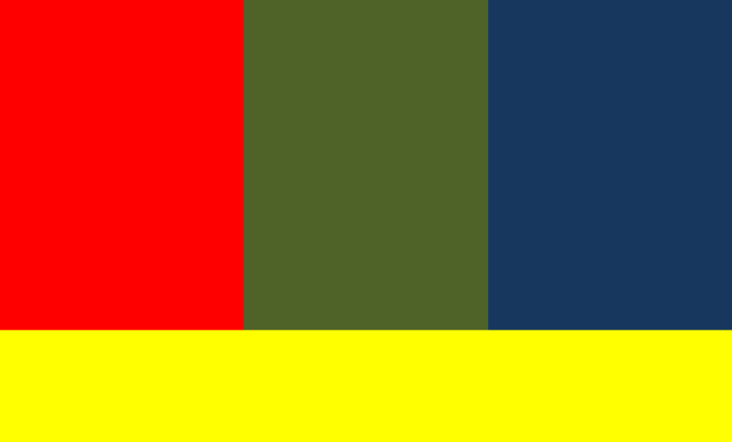
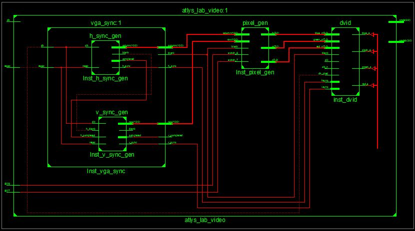
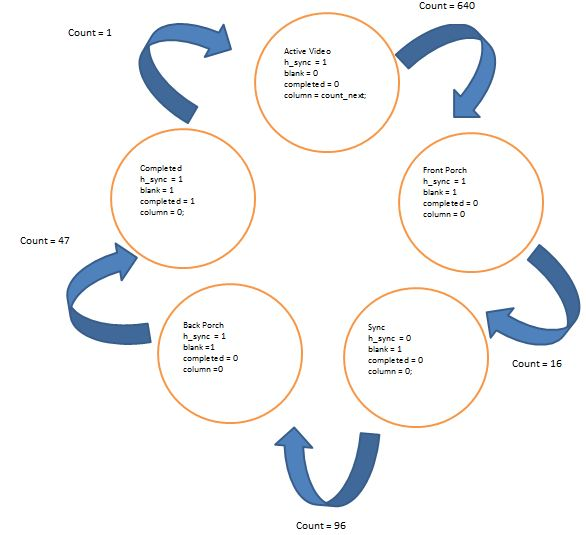
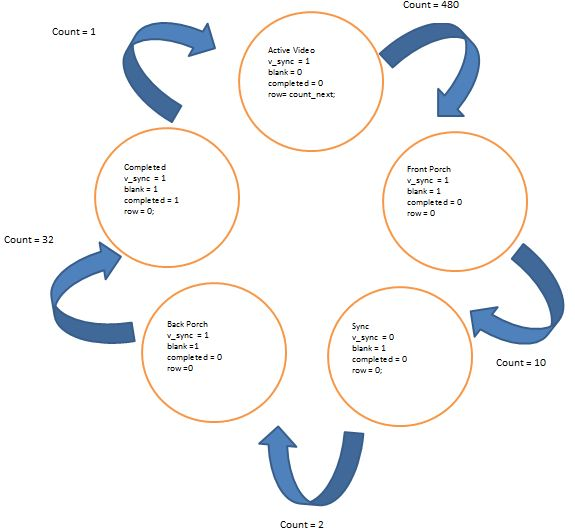

Lab1- VGA Editor
=========

C2C John Miller

VHDL code that generates a VGA signal based on the pattern described in the "pixel_gen.vhd" module. Example pattern below




This code also supports the use of the switches on the Atlys board for cycling through different patterns, these are also specified within pixel_gen 

Version
----

1.0

Implementation
-----------
The following basic constructs were used:

Flip-flop (memory element):

```Vhdl
process(clk, reset)
   begin
      if (reset='1') then
         state_reg <= ActiveVideo;
      elsif rising_edge(clk) then
        	state_reg <= state_next;
      end if;
end process;
```

Next State logic:

```Vhdl
process(count, state_reg)
    begin
		
		state_next <= state_reg;
	
		case state_reg is
			when ActiveVideo =>
				if (count = 639) then
					state_next <= FrontPorch;
				end if;
			when FrontPorch =>
				if (count = 15) then
					state_next <= Sync;
				end if;
			when Sync =>
				if (count = 95) then
					state_next <= BackPorch;
				end if;
			when BackPorch =>
				if (count = 46) then
					state_next <= Complete;
				end if;
			when Complete =>
				state_next <= ActiveVideo;	
		end case;
	end process;

```
Output logic

```Vhdl
process(state_next, count_next)
    
   begin
		h_sync <= '0';
		blank <='0';
		completed <='0';
		column <= (others => '0');
       
      case state_next is
         when ActiveVideo =>
            h_sync <= '1';
				blank <='0';
				completed <='0';
				column <= count_next;
         when FrontPorch =>
            h_sync <= '1';
				blank <='1';
				completed <='0';
				column <= (others => '0');
         when Sync =>
            h_sync <= '0';
				blank <='1';
				completed <='0';
				column <= (others => '0');
         when BackPorch =>
            h_sync <= '1';
				blank <='1';
				completed <='0';
				column <= (others => '0');
			when Complete =>
			   h_sync <= '1';
				blank <='1';
				completed <='1';
				column <= (others => '0');
      end case;
   end process;
```

The following modules were to generate the signal
* h_sync_gen.vhd - Synchronizes the horizontal aspect of the signal
* v_sync_gen.vhd - Synchronizes the vertical aspect of the signal
* vga_sync.vhd - Synchronizes the h_sync and v_sync signals to specify a specific pixel 
* pixel_gen.vhd - Outputs the color pattern
* atlys_lab_video.vhd - Top-shell module
* dvid.vhd - Outputs the HDMI signal (converted by hardware to vga)

The modules are connected as shown below:



State transition diagram

H_sync:

 

V_sync:




Installation
--------------

```sh
git clone [git-repo-url] dillinger
cd dillinger
npm i -d
mkdir -p public/files/{md,html,pdf}
```

##### Configure Plugins. Instructions in following README.md files

* plugins/dropbox/README.md
* plugins/github/README.md
* plugins/googledrive/README.md

```sh
node app
```


License
----

MIT


**Free Software, Hell Yeah!**

[john gruber]:http://daringfireball.net/
[@thomasfuchs]:http://twitter.com/thomasfuchs
[1]:http://daringfireball.net/projects/markdown/
[marked]:https://github.com/chjj/marked
[Ace Editor]:http://ace.ajax.org
[node.js]:http://nodejs.org
[Twitter Bootstrap]:http://twitter.github.com/bootstrap/
[keymaster.js]:https://github.com/madrobby/keymaster
[jQuery]:http://jquery.com
[@tjholowaychuk]:http://twitter.com/tjholowaychuk
[express]:http://expressjs.com

    
