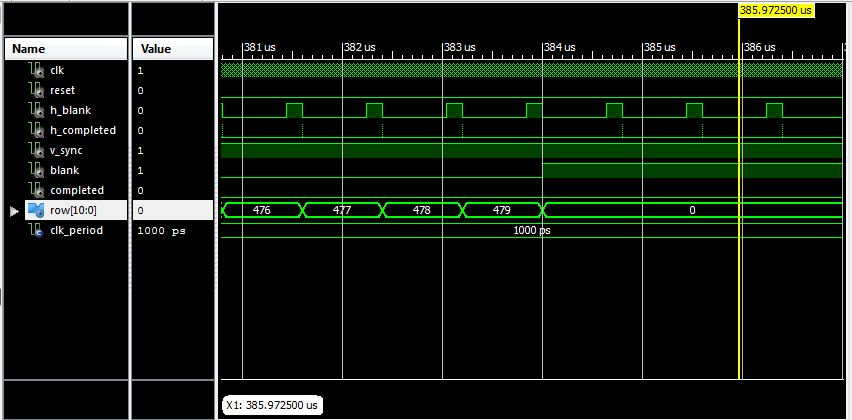

Lab1- VGA Editor
=========

C2C John Miller

VHDL code that generates a VGA signal based on the pattern described in the "pixel_gen.vhd" module. Example pattern below


This code also supports the use of the switches on the Atlys board for cycling through different patterns, these are also specified within pixel_gen 

Version
----

1.0

Implementation
-----------
The following basic constructs were used:

Flip-flop (memory element):

```Vhdl
process(clk, reset)
   begin
      if (reset='1') then
         state_reg <= ActiveVideo;
      elsif rising_edge(clk) then
        	state_reg <= state_next;
      end if;
end process;
```

Next State logic:

```Vhdl
process(count, state_reg)
    begin
		
		state_next <= state_reg;
	
		case state_reg is
			when ActiveVideo =>
				if (count = 639) then
					state_next <= FrontPorch;
				end if;
			when FrontPorch =>
				if (count = 15) then
					state_next <= Sync;
				end if;
			when Sync =>
				if (count = 95) then
					state_next <= BackPorch;
				end if;
			when BackPorch =>
				if (count = 46) then
					state_next <= Complete;
				end if;
			when Complete =>
				state_next <= ActiveVideo;	
		end case;
	end process;

```
Output logic

```Vhdl
process(state_next, count_next)
    
   begin
		h_sync <= '0';
		blank <='0';
		completed <='0';
		column <= (others => '0');
       
      case state_next is
         when ActiveVideo =>
            h_sync <= '1';
				blank <='0';
				completed <='0';
				column <= count_next;
         when FrontPorch =>
            h_sync <= '1';
				blank <='1';
				completed <='0';
				column <= (others => '0');
         when Sync =>
            h_sync <= '0';
				blank <='1';
				completed <='0';
				column <= (others => '0');
         when BackPorch =>
            h_sync <= '1';
				blank <='1';
				completed <='0';
				column <= (others => '0');
			when Complete =>
			   h_sync <= '1';
				blank <='1';
				completed <='1';
				column <= (others => '0');
      end case;
   end process;
```

The following modules were to generate the signal
* h_sync_gen.vhd - Synchronizes the horizontal aspect of the signal
* v_sync_gen.vhd - Synchronizes the vertical aspect of the signal
* vga_sync.vhd - Synchronizes the h_sync and v_sync signals to specify a specific pixel 
* pixel_gen.vhd - Outputs the color pattern
* atlys_lab_video.vhd - Top-shell module
* dvid.vhd - Outputs the HDMI signal (converted by hardware to vga)

The modules are connected as shown below:


State transition diagram

H_sync:

 

V_sync:


Troubleshooting
--------------

The biggest troubles I had can be separated by module:

H_sync_gen

-   Transitioning from backporch to active video gave me a lot of problems because it held the column value at 0 for an extra clock cycle, which threw off a lot of the functionality. This was fixed bey changing the sensitivity of that process to by sensitive to the count_next register instead of the count value.

V_sync_gen
- I didn't make the state transitions sesnsitive to "h_completed", so the state was changing too often and wouldn't hold at individual pixels, so the VGA monitor could not interpret the output. 
- This module gave a lot of problems with being one clock cycle off, so adjusting all of the state transition conditions by 1 alleviated this.

Pixel_gen

- This did not give much trouble, I tried to get too fancy with color states (will be implemented in a future update), so I couldn't tell where the problem was. For testing, I changed the output to a single color and tested it, then I changed it to a more complex pattern when it worked.

VGA_sync
- This was a very simple module, the only error I had was with my output logic, I was using "and" when I needed to use  "or".

Confirming functionality
--------------

Testing the module's funcitonality consisted of running tesbenches and asserting that each module would have certain outputs at certain clock cycles. Example code is given below.

```VHDL
  stim_proc: process
   begin    	
      -- hold reset state for 100 ns.
		reset <= '1';
	   wait for 5 ns;	
		assert (h_sync = '1') report "init not working - h_sync";
		assert (blank = '0') report "init not working - blank";
		assert (completed = '0') report "init not working - completed";
		assert (column = 1) report "init not working - column";
  
		reset <= '0';


      wait for clk_period*1;
		assert (h_sync = '1') report "active video not working - h_sync";
		assert (blank = '0') report "active video not working - blank";
		assert (completed = '0') report "active video not working - completed";
		assert (column = 2) report "active video not working - column";
		
		wait for clk_period*637;
		assert (h_sync = '1') report "active video not working - h_sync";
		assert (blank = '0') report "active video not working - blank";
		assert (completed = '0') report "active video not working - completed";
		assert (column = 639) report "active video not working - column";
		
      wait;
   end process;

```
An example waveform for the example code is shown below


The hardest thing to test was the V_sync module, as it was hard to time out clock cycles, since it relied on the H_sync module to assert its "completed" signal. That testing was done by viewing the waveform, which is shown below.



Lessons Learned
---

* The main lesson was to have thorough testbenches, looking through mine, I didn't put quite as much effort in as I should have
* 


##### Configure Plugins. Instructions in following README.md files

* plugins/dropbox/README.md
* plugins/github/README.md
* plugins/googledrive/README.md

```sh
node app
```


License
----

MIT


**Free Software, Hell Yeah!**

[john gruber]:http://daringfireball.net/
[@thomasfuchs]:http://twitter.com/thomasfuchs
[1]:http://daringfireball.net/projects/markdown/
[marked]:https://github.com/chjj/marked
[Ace Editor]:http://ace.ajax.org
[node.js]:http://nodejs.org
[Twitter Bootstrap]:http://twitter.github.com/bootstrap/
[keymaster.js]:https://github.com/madrobby/keymaster
[jQuery]:http://jquery.com
[@tjholowaychuk]:http://twitter.com/tjholowaychuk
[express]:http://expressjs.com

    
